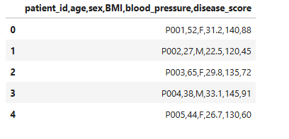
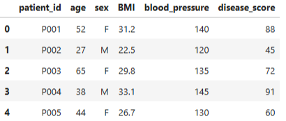
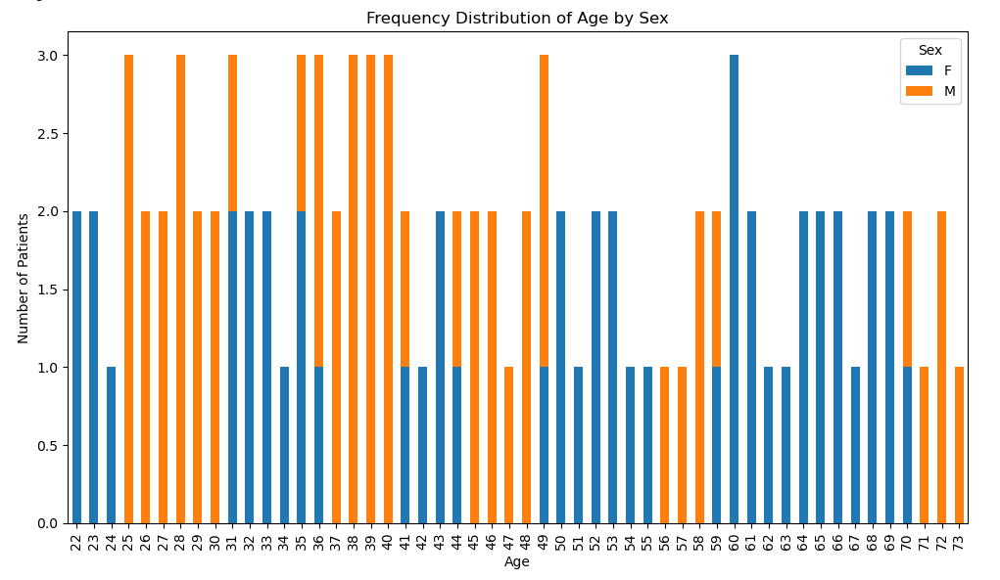
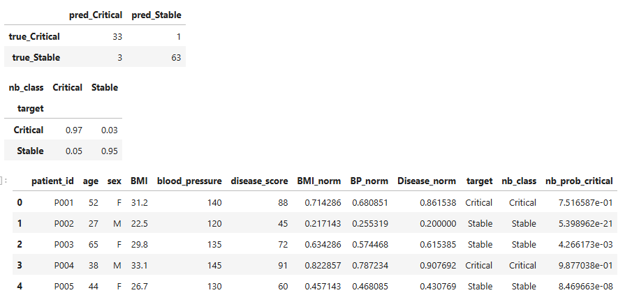

🏥 Eastern Cape Health Audit

Data Quality, Risk Classification & Ethical Analytics

The Eastern Cape Department of Health initiated a province-wide audit to improve data quality, chronic illness tracking, and triage decision-making in under-resourced clinics.

This project analyses a sample of clinic patient records collected from Mthatha, Queenstown, and rural areas around Lusikisiki, transforming messy health data into clean, interpretable, and ethically-aware insights.

🎯 Objectives

This audit focused on five core goals:

Clean and standardise patient health data

Compare a random clinic sample to the full population

Identify demographic patterns using frequency analysis

Apply a simple, interpretable Naïve Bayes–style classification

Produce a cleaned, classified dataset suitable for policy and triage support

📊 Raw Data (Before Cleaning)

The original dataset suffered from:

Duplicated records

Missing values

Inconsistent formatting

Wide variation in health metrics

Raw Dataset Snapshot

Why this matters:
Decisions made on unclean health data can lead to misclassification, bias, and unsafe triage outcomes.

🧹 Data Cleaning & Normalisation (After)

The dataset was cleaned by:

Removing duplicate rows

Filling missing numeric values using column means

Normalising key health indicators (BMI, blood pressure, disease score)

Cleaned Dataset Snapshot

This step ensures:

Fair comparisons between patients

Stable inputs for classification

Improved reliability for downstream analysis

📈 Frequency Distribution: Age by Sex

To understand demographic structure, a frequency distribution of age by sex was created.

Insights:

Patients span a wide age range, with clusters in middle-to-older age groups

Both male and female patients are represented across most age bands

Supports targeted planning for age-related chronic conditions

🔬 Feature Scaling & Preparation

Health metrics were normalised to ensure no single variable dominated the classification logic.

This step is critical for:

Probabilistic reasoning

Fair threshold comparisons

Transparent risk logic

🚦 Patient Risk Classification (Naïve Bayes–Style)

A simple, interpretable Naïve Bayes–style approach was applied to classify patients as:

Critical

Stable

Classification was based on:

Normalised BMI

Normalised disease score

Combined likelihood logic (not a black-box model)

Model Output Snapshot

The approach prioritises:

Explainability over complexity

Safety in low-resource settings

Support for human clinical judgment

⚖️ Ethical Considerations

Important:
This analysis is designed to support, not replace, healthcare professionals.

Ethical safeguards include:

No automated treatment decisions

Transparent, rule-based logic

Explicit documentation of assumptions

Recognition of data limitations and bias risks

In under-resourced clinics, human oversight remains essential.

📦 Outputs

Cleaned and normalised patient dataset

Classified patient risk labels (Critical / Stable)

Visual summaries for demographic and health patterns

Reusable Python utilities for future audits

👤 Author

Muhammed Uwais Adam
Data Analysis | Healthcare Analytics | Ethical AI | Python

